# Package venn

This package produces Venn diagrams for up to seven sets, using any Boolean union of set intersections.


Installation
------------

Install the stable version from CRAN:
``` r
install.packages("venn")
```

Examples
--------

A simple Venn diagram with 3 sets
``` r
venn(3)
```

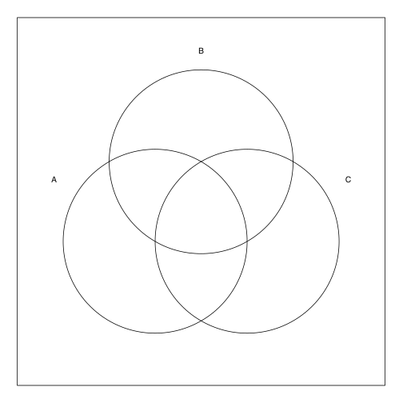


With a vector of counts: 1 for "000", 2 for "001" etc.
``` r
venn(3, counts = 1:8)
```

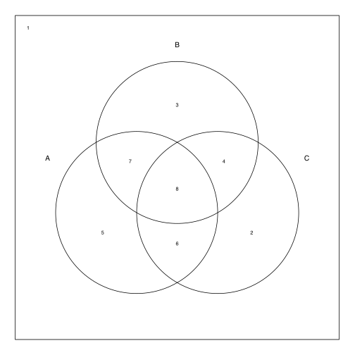


Display the first whole set
``` r
venn("1--")
```


Same with
``` r
venn("A", snames = "A, B, C")
```


An equivalent command, from the union of all intersections
``` r
venn("100 + 110 + 101 + 111")
```


Same with
``` r
venn("A~B~C + AB~C + A~BC + ABC")
```


Adding the labels for the intersections
``` r
venn("1--", ilabels = TRUE)
```

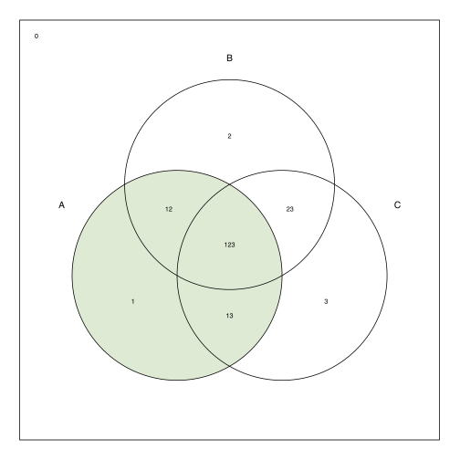


Using different parameters for the borders
``` r
venn(4, lty = 5, col = "navyblue")
```

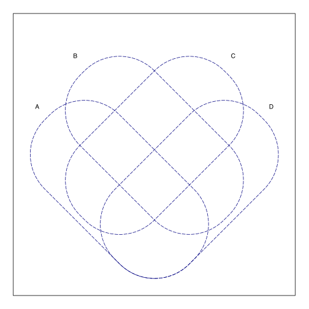


Using ellipses
``` r
venn(4, lty = 5, col = "navyblue", ellipse = TRUE)
```

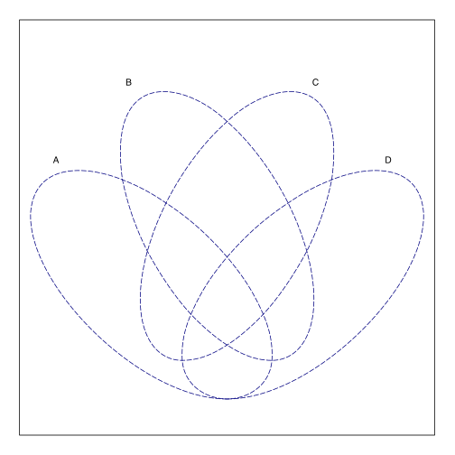


A 5 sets Venn diagram
``` r
venn(5)
```

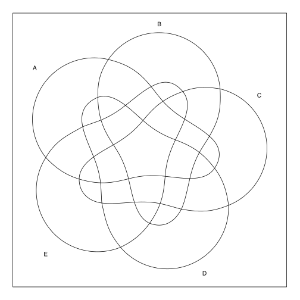


A 5 sets Venn diagram using ellipses
``` r
venn(5, ellipse = TRUE)
```

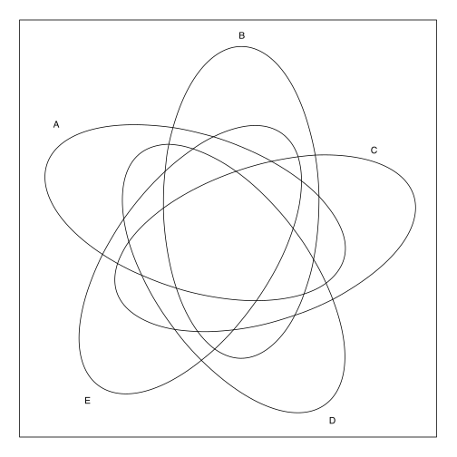


A 5 sets Venn diagram with intersection labels
``` r
venn(5, ilabels = TRUE)
```

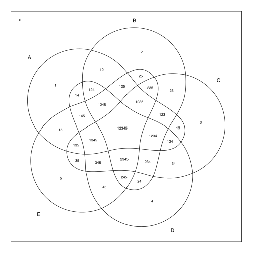


And a predefined color style
``` r
venn(5, ilabels = TRUE, zcolor = "style")
```

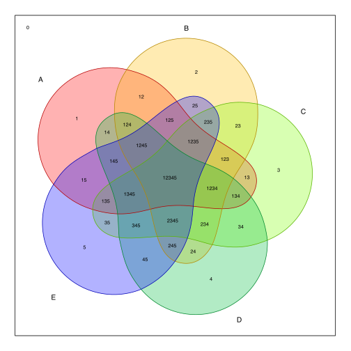


A union of two sets
``` r
venn("1---- + ----1")
```

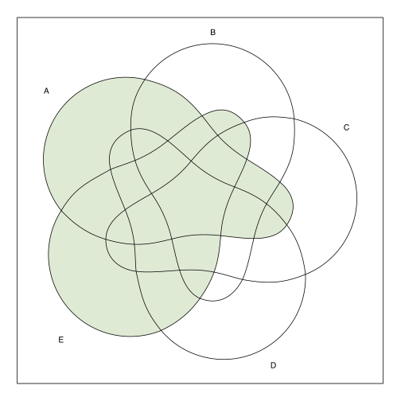


Same with
``` r
venn("A + E", snames = "A, B, C, D, E")
```


With different colors
``` r
venn("1---- , ----1", zcolor = "red, blue")
```

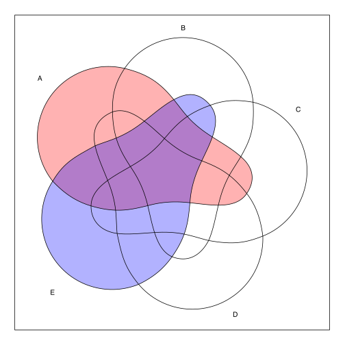


Same using SOP - sum of products notation
``` r
venn("A, E", snames = "A, B, C, D, E", zcolor = "red, blue")
```


Same colors for the borders
``` r
venn("1---- , ----1", zcolor = "red, blue", col = "red, blue")
```


A 6 sets diagram
``` r
venn(6)
```

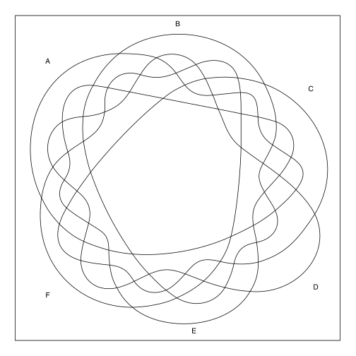


Seven sets "Adelaide"
``` r
venn(7)
```

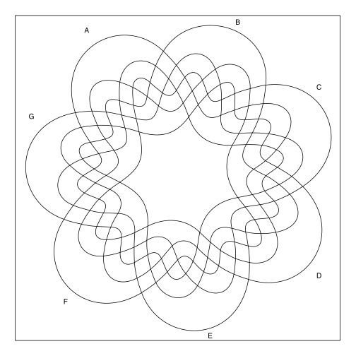


Artistic version
``` r
venn(c("1000000", "0100000", "0010000", "0001000",
       "0000100", "0000010", "0000001", "1111111"))
```

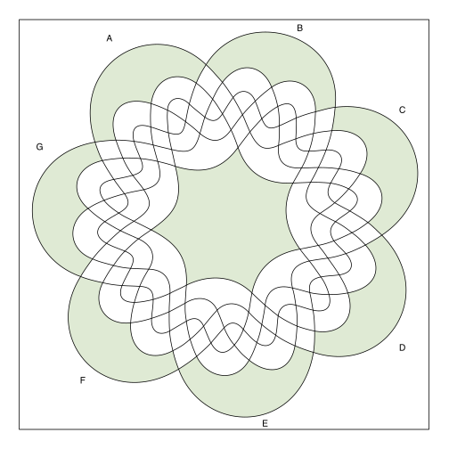


Without all borders
``` r
venn(c("1000000", "0100000", "0010000", "0001000",
       "0000100", "0000010", "0000001", "1111111"),
     borders = FALSE)
```

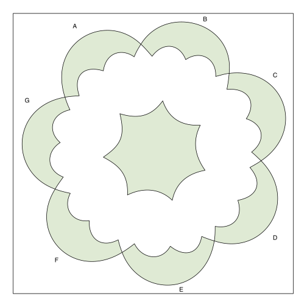


Using SOP - sum of products notation
``` r
venn("A + B~C", snames = "A, B, C, D")
```

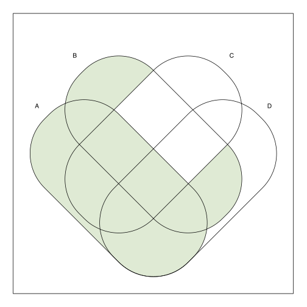


The input can be a list
``` r
set.seed(12345)
x <- list(First = 1:20, Second = 10:30, Third = sample(25:50, 15))
venn(x)
```

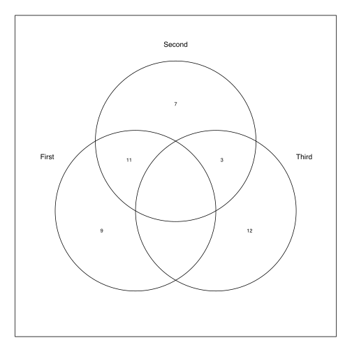


Or a dataframe
``` r
set.seed(12345)
x <- as.data.frame(matrix(sample(0:1, 150, replace = TRUE), ncol = 5))
venn(x)
```

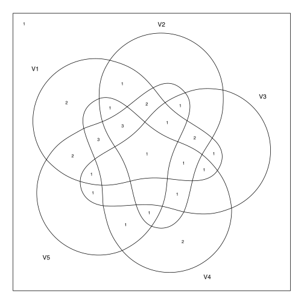


Using ggplot2 graphics
``` r
venn(x, ggplot = TRUE)
```

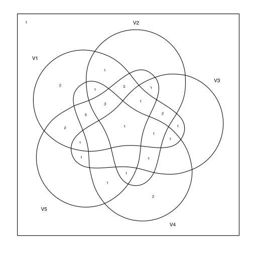


Increasing the border size
``` r
venn(x, ggplot = TRUE, size = 1.5)
```

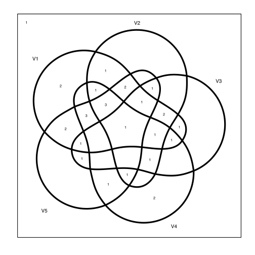


With dashed lines
``` r
venn(x, ggplot = TRUE, linetype = "dashed")
```

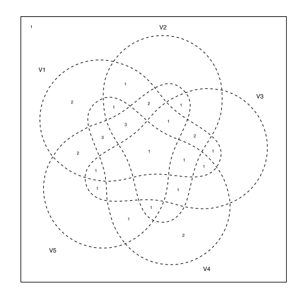


Venn diagrams for QCA objects
``` r
library(QCA)

data(CVF)
obj <- truthTable(CVF, "PROTEST", incl.cut = 0.85)

venn(obj)
```

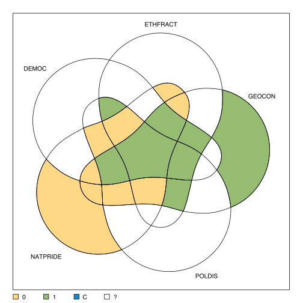


Custom labels for intersections
``` r
pCVF <- minimize(obj, include = "?")
venn(pCVF$solution[[1]], zcol = "#ffdd77, #bb2020, #1188cc")
cases <- paste(c("HungariansRom", "CatholicsNIreland", "AlbaniansFYROM",
                 "RussiansEstonia"), collapse = "\n")
coords <- unlist(getCentroid(getZones(pCVF$solution[[1]][2])))
text(coords[1], coords[2], labels = cases, cex = 0.85)
```

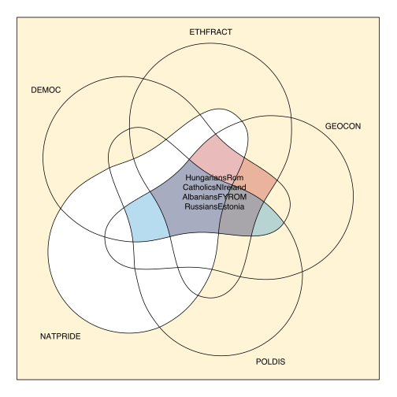
